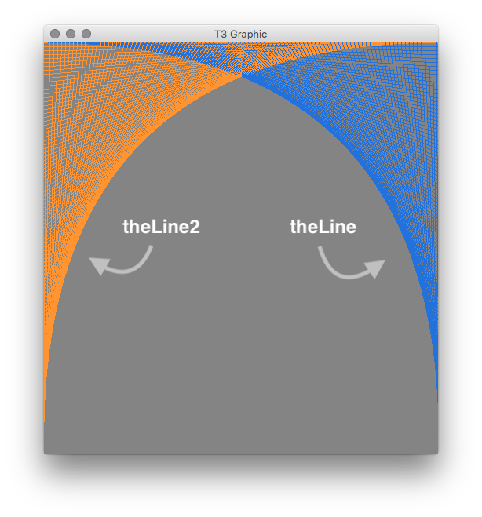

<div class="container">
  <div class="mx-4"  markdown="1">

{:.mb-0}
#### Test 3 Answers

Spring 2018 CSC 204

1\. Complete the following Truth Table. Use `T` and `F` to indicate true and false.

<div class="row">
  <div class="col-sm-8" markdown="1">

| A   | B   | A && B | !A \|\| B | !(!A) |
| :-: | :-: | :----: | :-------: | :---: |
| T   | T   | T      | T         | T     |
| T   | F   | F      | F         | T     |
| F   | T   | F      | T         | F     |
| F   | F   | F      | T         | F     |

  </div>
  <div class="col-sm-4 py-5" markdown="1">

  Once again, `&&` means *and*, `\\` means *or* and `!` reverses the boolean value.

  </div>
</div>
<br>

2\. What is the output for the following Java code?

<div class="row mb-2">
  <div class="col-sm-6">


for (int CSC = 100; CSC > 50; CSC -= 25)
  for (int IST = 3; IST <= 5; IST++)
    System.out.println(CSC + IST);


  </div>
  <div class="col-sm-2" markdown="1">

```
103
104
105
78
79
80
```
  </div>
  <div class="col-sm-4" markdown="1">

  There are no `""` inside the `println` argument, so the program will print a mathematical result rather than a string. `CSC` is not allowed to go under `50`, so the first `for` loop will repeat itself twice. The `IST` for loop is allowed to reach `5`, so it will repeat itself 3 times.

  </div>
</div>
<br>

3\. What is the output for the following Java code?

<div class="row mb-2">
  <div class="col-sm-6">


for (int CSC = 100; CSC > 50; CSC -= 25)
  for (int IST = 3; IST <= 5; IST++)
    System.out.println(CSC + "+" + IST);


  </div>
  <div class="col-sm-2" markdown="1">

```
100+3
100+4
100+5
75+3
75+4
75+5
```

  </div>
  <div class="col-sm-4" markdown="1">

  Because we now have `""` inside the print argument, the output text is strings rather than the result of adding two variables.

  </div>
</div>
<br>

4\. Write an entire `public static` method named `isEven` that is passed a single integer and returns `true` or `false` stating whether or not the integer is even. This method would return `false` when an odd number is passed in.

<div class="row mb-2">
  <div class="col-sm-6">


public static boolean isEven(int n) {
  if (n % 2 == 0)
    return true;
  else {
    return false;
  }
}


  </div>
  <div class="col-sm-6" markdown="1">

  The **MOD** function (`%`) gives us the remainder of a division. In this case, if mod is not `0`, we can conclude the number is not even. (Since even numbers would never have a remainder when divided by two.) `public static boolean` is used because we need this method to return `true` or `false` values.

  </div>
</div>

<br>
<br>
<br>

5\. Help me write an infinite loop that alternated printing `"Orange"` and `"Black"`. Each underline needs some Java code. You should not write any more code than where you see underlines.

<div class="row">
  <div class="col-sm-5">


int turn = 0;
while (true) {
  if (turn == 0) {
    System.out.println("Orange");
    turn = turn + 1;
  }
  else {
    System.out.println("Black");
    turn = turn - 1;
  }
}


  </div>
  <div class="col-sm-5" markdown="1">

```java
// Declaring the turn variable.
// while (true) is an infinite loop.
// if  turn equals 0...
// Print "Orange" and...
// Add 1 to the int turn.
// End of first part of if statement.
// If  turn DOES NOT equal 0...
// Print "Black" and...
// Subtract 1 from the int turn.
// End of else statement.
// End of while loop.
```

  </div>
  <div class="col-sm-2" markdown="1">

```
Orange
Black
Orange
Black
Orange
Black
Orange
Black
Orange
Black
...
```

  </div>
</div>
<br>

6\. Sketch out approximately the graphic that the following code generates. Don't worry about the 100 lines... Just show a pattern with a few lines. Assume the needed `include` files exist.

<div class="row">
  <div class="col-sm-7">


final int LINES = 100;
int width = getWidth();
int height = getHeight();
int hinc = height/LINES;
int winc = width/LINES;

for (int i = 0; i <= LINES; i++) {
  Line2D.Double theLine =
    new Line2D.Double(i*winc,0,width,i*hinc);
  g2.draw(theLine);
  Line2D.Double theLine2 =
    new Line2D.Double(width-(i*winc),0,0,i*hinc);
  g2.draw(theLine2);
}


  </div>
  <div class="col-sm-5">

    

  </div>
</div>
<br>

7\. Help me write some code that will count how many **r's** are in a `String`. Fill in all of the blank lines in the code below.

<div class="row mb-2">
  <div class="col-sm-5">


String word = "Mercer Bears are Great!";
int count = 0;
char lookingFor = 'r';
for (int i = 0; i < word.length(); i++) {
  if (word.charAt(i) == lookingFor)
    count++
}
System.out.println("Found: " + count);


  </div>
  <div class="col-sm-7" markdown="1">

```java
// Declaring the String "word".
//
// Declaring the int "count" as 0.
// Declaring the char "lookingFor" as "r".
// For loop that loops through the String "word".
//
// If the char equals the char "lookingFor"...
// Add 1 to the integer count.
// End of if statement.
// Print the times the char "lookingFor" appeared.
//
```

  </div>
</div>
<br>
<br>

8\. Write a `public static` method named `printStars`, that is passed an integer number of stars to be printed on a single line. This method should then print that number of `*`s, side by side on a single line, followed by a new line at the end. This method should not return anything, just print stars.


public static void printStars (int n) {
  for (int i = 0; i < n; i++) {
    System.out.print("\*");
  }
  System.out.println();
}


<br>

9\. Assume your `printStars` method works as specified. Write a `public static` method named `printTriangle`, that is passed a single integer for the width and height of the triangle, that calls your `printStars` method multiple times to reproduce a triangle as demonstrated below.

<div class="row mb-2">
  <div class="col-sm-3" markdown="1">

```
printTriangle(3);
*
**
***
```

  </div>
  <div class="col-sm-3" markdown="1">

```
printTriangle(5);
*
**
***
****
*****
```

  </div>
  <div class="col-sm-6" markdown="1">

```java
public static void printTriangle (int n) {
  for (int i = 1; i <= n; i++) {
    printStars(n);
  }
}
```

  </div>
</div>

<br>

10\. How many String objects are created in the following code? Assume we have a Scanner object, named `in`, that reads from the keyboard.

```java
String Weekend = in.nextLine().trim().toUpperCase().toLowerCase();
```

4 strings created, the standard one, a trimmed one with no leading spaces or tabs, uppercased string, and lowercased string.

11. The Picture API from our textbook can be found at the end of this test. It may help you remember some of the functionality of Pictures.

Write a nested loop that transforms every pixel in `t3Pic` (given below) so that the picture is darker. Recall that the Color class stores colors as RGB values, and that RGB of (0, 0, 0) is black, and RGB value of (255, 255, 255) is white. Note that lower numbers means darker colors. Assume all needed files are included.

```java
Picture t3Pic = new Picture();
t3Pic.pick();   // Gets the picture.

width = t3Pic.getWidth();
height = t3Pic.getHeight();

for (x = 0; x < width; x++)
  for (y = 0; y < height; y++) {
    Color darkened = new Color (t3Pic.getRed(x,y)/2,
                                t3Pic.getGreen(x,y)/2,
                                t3Pic.getBlue(x,y)/2);
    t3Pic.setColorAt(x, y, darkened);
  }

```

</div>
</div>
