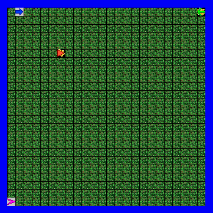

{:.mb-4}
Jump to [Test 2](#test-2).

## Test 1
This test reviewed most of Jeroo and simple boolean expressions. Most of the material is taken from the [Jeroo Textbook](http://home.cc.gatech.edu/dorn/uploads/41/JerooDocJava.pdf).

#### Jeroo questions

| Question                                                                  | Answer                                          |
| ------------------------------------------------------------------------- | ----------------------------------------------- |
| Where is Santog Island Located?                                           | South Pacific Ocean                             |
| Santog Island is a grid of locations. What is each location called?       | A `cell`                                        |
| How many rows are in the grid on the island?                              | `24`                                            |
| How many columns are in the grid on the island?                           | `24`                                            |
| What is the address of the upper right corner on the island?              | `0, 23`                                         |
| What is the address of the lower left corner of the island?               | `23, 0`                                         |
| Give one address on the island that is as close to the center as possible | `(11, 11)` `(11, 12)`  `(12, 11)` `(12, 12)` |
| What is the name of the method in Jeroo that runs first?                  | `main()`                                        |
| What is the largest number of Jeroos you can put into the main method?    | `4`                                             |
| What is the largest number of Jeroos you can put into the Jeroo method?   | `0`                                             |

---

#### Truth table

| P     | Q     | P && Q | P \|\| Q | !P    |
| ----- | ----- | ------ | -------- | ----- |
| true  | true  | true   | true     | false |
| true  | false | false  | true     | false |
| false | true  | false  | true     | true  |
| false | false | false  | false    | true  |

`&&` operators mean _and_, while `||` operators mean _or_. For an `&&` to output true, all the statements have to be true. For an `||` to be true, there needs to be at least one statement that is true. The `!` operator inverts the boolean value, so `true` becomes `false` and vice-versa.

If `P` is true and `Q` is true, what would `(!P || Q) && Q` output?

An in-depth explanation of all of this can be found in page 57 of the [Jeroo Textbook](http://home.cc.gatech.edu/dorn/uploads/41/JerooDocJava.pdf).

---

#### What should you put at the top of any source code you write?
This question is basically asking you to write your name and stuff at the top. I do it like this:


// Name
// Assignment
// Due Date
// Class (CSC-204)


`//` means the start of a single-line comment. Jeroo doesn't support multi-line comments, so that's all we can use.

---

#### Select the correct term

|  | Term | Definition |
| ------ | ---- | ---------- |
| G. | Computer Program | Is a set of instructions for a computer.                                                                                               |
| R. | Source Code      | This is written by a programmer in some programming language.                                                                          |
| L. | Interpreter      | Translates a program into machine language one statement at a time.                                                                    |
| F. | Compiler         | Translates a program into machine language as a whole.                                                                                 |
| A. | Algorithm        | A plan for solving a problem.                                                                                                          |
| D. | Case-sensitive   | When upper-case and lower-case letters are treated as different from one another.                                                      |
| S. | Syntax           | The valid format for writing code.                                                                                                     |
| Q. | Semantics        | The meaning associated with valid code.                                                                                                |
| P. | Object           | A representation of a specific concept or item that is relevant to the problem being solved in code.                                   |
| E. | Class            | The collection of statements that are written in some programming language to describe both the attributes and behaviors of an object. |

The difference between a **compiler** and an **interpreter** is _how_ the source code is made into machine language. Compilers do it as a whole, while interpreters do it one statement at a time. This information can be found on page 3 of the Jeroo Textbook.

An **object** represents a specific concept or item that is relevant to the problem we are trying to solve. In the case of Santog Island, Jeroo is the object. A **class** is a collection of statements that describe both the attributes and the behaviors of an object. This is what the creators of Jeroo specified in order for us to be able to create Jeroos. This information is available on pages 5 through 7 of the Jeroo Textbook.

---

#### Jeroo Methods

  

> Write the Jeroo method `turnAround()` with the least number of characters possible

  

  


method turnAround() {
  turn(LEFT);
  turn(LEFT);
}


  

  

> Write a Jeroo method named `faceWest()` with a conditional and while statement. Use the least amount of characters.

  

  


method faceWest() {
  while (!isFacing(WEST)) {
    turn(LEFT);
  }
}


  

  

> Write a Jeroo method named `hopToWater()` that will hop forward until it encounters water in the space ahead. Disregard nets, flowers, and other Jeroos.

  

  


method hopToWater() {
  while (!isWater(AHEAD)) {
    hop();
  }
}


  

  

> Write a Jeroo method named `turnForever()` that turns **right** forever. Assume "true" is not available.

  

  


method turnForever() {
  while (isJeroo(HERE)) {
    turn(RIGHT);
  }
}


  

  

> Write a Jeroo method named `convertNetWall2FlowerWall()` that makes a Jeroo hop along a net wall directly in front of him, converting it into a flower wall, as long as it has flowers.

  

  


method convertNetWall2FlowerWall() {
  while (isNet(AHEAD) && hasFlower()) {
    toss(); hop(); plant();
  }
}


  

#### Interpreting Jeroo

  


method main() {
  Jeroo bob = new Jeroo(25);
  bob.plant();
  while (!bob.isWater(AHEAD)) {
    bob.hop();
    bob.turn(RIGHT);
    bob.hop();
    bob.turn(LEFT);
    bob.plant();
  }
}


  

  

    
  

| Question (after program runs)                          | Answer   |
| ------------------------------------------------------ | -------- |
| What is the address of bob?                            | `23, 23` |
| What direction will bob be facing?                     | `EAST`   |
| How many flowers will bob be holding?                  | `1`      |
| What pattern of flowers has been placed on the island? | Diagonal |

If we do end up getting another question like this in the exam, I would suggest that you grab some graphing paper and just draw the sequence out. It's easy to make mistakes if you do it all in your head, so be careful.

  


method main() {
  Jeroo a = new Jeroo();
  Jeroo b = new Jeroo(5, 6, 7);
  Jeroo c = new Jeroo(23, 0, NORTH);
  Jeroo d = new Jeroo(0, 23, WEST, 10);
  a.hop();
  b.plant();
  b.plant();
  c.turn(RIGHT);
  while (!d.isFlower(AHEAD)) {
    d.plant();
  }
}


  

  

    
  

| Question                                                                                       | Answer |
| ---------------------------------------------------------------------------------------------- | ------ |
| When the Jeroos are first placed on the Island, how many are facing `EAST`?                    | `2`    |
| After all lines of code have executed, how many Jeroos are facing `EAST`?                      | `3`    |
| When the Jeroos are first placed on the island, collectively how many flowers do they have?    | `17`   |
| After all lines of code have executed, collectively how many flowers are being held by Jeroos? | `5`    |
| Throughout this program, how many Jeroos are in the Northeast quadrant of the island?          | `1`    |
| `true` or `false`? This program has an infinite loop.                                          | `true` |

 

## Test 2
The beginning of the Java portion of the course

#### Code Legality
System.out.println is abreviated as S.o.pln here.

| Code                                                        | Legal?                                                         |
| ----------------------------------------------------------- | -------------------------------------------------------------- |
| int a, b, c;        | Yes. Proper syntax.                                            |
| int d = d + 1;      | No. Can't declare a value and edit it at the same time.        |
| integer value;      | No. `integer` should be `int`, `value` needs to be an integer. |
| a + b = c;          | No. In order for this to work, `c` should be on the left side. |
| 3 = a + b;          | No. `3` is an integer, it cannot be a variable.                |
| S.o.pln("a" + "b"); | Yes. Properly adds the two variables as strings.               |
| S.o.pln("a + "b");  | No. `("a + "b")` is not properly written.                      |
| int val : 12;       | No. The correct assignment symbol is `=`, not `:`.             |
| a = b + c           | No. It's missing the `;` at the end.                           |
| int i = 123.456;    | No. Integers cannot hold decimals. Use `double` instead.       |

#### Comment Legality

| Code                                                                   | Legal?                                                 |
| ---------------------------------------------------------------------- | ------------------------------------------------------ |
| // CSC 204 Test 2              | Yes. Single-line comment.                              |
| int test = 2 // This is test 2 | Yes. Code with a single-line comment.                  |
| /* Test Two */                 | Yes. Block comment.                                    |
| */ Second Test */              | No. Improper syntax. Should begin with `/*`, not `*/`. |
| /* Tests are fun               | Yes. Start of block, considered line in this test.     |

Single-line comments start with `//` and have no ending. Block comments start with `/*` and end with `*/`. Dr. Allen considers `/* Tests are fun` to be a single line comment, so you should go with that in the test. In reality, `/*` marks the start of a block comment, and it is considered a block comment even if it only contains a single line, since the rest of the code will be commented out until the ending `*/` appears.

#### Java Math Calculations
Assuming that we have the following variables declared, what is the output of each statement below?


int a = 1, b = 2, c = 3, d = 4, e = 5, f = 6;
int orange = 5;
int black = 10;


| Statement                                                                               | Output                                        |
| --------------------------------------------------------------------------------------- | --------------------------------------------- |
| S.o.pln(orange*orange+orange/orange);           | `26` because `(5*5)+(5/5) = 26`               |
| S.o.pln(orange/black);                          | `0` because the `int` of `0.5` is `0`         |
| S.o.pln(black/orange);                          | `2` because `10/5 = 2`                        |
| S.o.pln(black/3);                               | `3` because `10/3 = 3.3`, `3` as `int`        |
| S.o.pln(black/3.0);                             | `3.3` because `10/3.0 = 3.3` (in Java)        |
| S.o.pln(((a+3)/(b*2))/(f-(2*c)+1));             | `1` because `(4/4)/(6-6+1) = 1`               |
| S.o.pln((((a+b)*c)-d)/2);                       | `2` because `5/2 = 2.5`, but `2` as `int`     |
| S.o.pln((a+b*c-d/2));                           | `5` because `7-2 = 5`                         |
| S.o.pln(Math.pow(Math.pow(Math.pow(a,b),c),d)); | `1.0`, `1^x` returns `double`                 |
| S.o.pln("a + b + c");                           | `a + b + c`, since `string`                   |

If we do get another table like this in the exam, remember [PEMDAS](https://www.mathsisfun.com/operation-order-pemdas.html) and that the data type will be the same in the output **if** no other data type is used during the math. For example, `1/2` will return `0`, but `1/2.0` will return `0.5`, since a `double` was used during the math operation. Also, `strings` are returned _as is_.

#### Data Types
The correct relationship for each data type is:

| Integer Data                               | Floating Point Data   |
| ------------------------------------------ | --------------------- |
| `byte` < `short` < `int` < `long`          | `float` < `double`    |

Floats and doubles will always be related to numbers with decimals, while byte, short, int, and long are numbers without decimals. The different integer data types specify how large the integer can be, while the floating point data types specify how many decimals the numbers can have.

To avoid complications, `int` can store integers, while `float` can store decimals.

#### General Questions
General stuff that will probably be asked in the final exam.

**1. What does API stand for?**

Application programming interface

**2. What does IDE stand for?**

Integrated development environment

**3. Name two IDEs that have been used in this class**

Jeroo and Eclipse

**4. If a Java file contains one class definition for "csc204", what must the file name be?**

`csc204.java`

**5. Given the BankAccount class defined in our textbook, how many BankAccount objects can you create in one Java program?**

Trick question. There is no specific limit. The only limiting factor is your system's hardware, but there is no hard limit. In theory, with enough resources, you could create an infinite amount of bank accounts.

**6. Thinking about the BankAccount class from our textbook, it had one instance variable named balance. Which of the following best describes balance?**

private double balance; since you need to be able to store decimals but you don't want other classes to have access to the balance variable.

**7. The Java programming language is:**

Case-sensitive.

#### Rectangles
Indicate weather the following method references are Accessors, Mutators, or neither.

| Method             | Type                                         |
| ------------------ | -------------------------------------------- |
| `getHeight()`      | Accessor                                     |
| `getWidth()`       | Accessor                                     |
| `setRect()`        | Neither, need for variables inside method.   |
| `setRect(1,2,3,4)` | Mutator                                      |
| `getX(5)`          | Neither, no variables should be passed.      |
| `getY()`           | Accessor                                     |
| `setY(5)`          | Neither, method does not exist.              |
| `setSize(1,2,3,4)` | Neither, only height and width in variables. |
| `translate(10,20)` | Mutator                                      |
| `new Rectangle()`  | Neither, this instantiates a new rectangle.  |

> Assume you have created a Rectangle named "block" in your program. Write one line of Java code that will create a new double variable named "area" and assign it with the calculations of the area of "block".


double area = block.getHeight() * block.getWidth();



> Give the Java code to calculate the following mathematical expression. Assume that the variable `x`, `y`, and `z` have been created as doubles and filled with values.

  

    
  

  



123 + Math.sqrt(3 * x * y + 2)/(Math.pow(z, 5) - 1)



  

#### Understanding Java Graphics

  

Use the graphic to the right to answer the following questions. The Test 2 JFrame is 500 by 500 pixels.

Match the Java statements to the circles and squares in the graphic. The numbers on the circles and squares were not made with Java graphics, but placed on the graphic to help you identify each. Some Java code does not fit in the box. Assume each code is entered on one line.

  

  

    

  

| Code                                                                                                                               | Figure      |
| ---------------------------------------------------------------------------------------------------------------------------------- | ----------- |
| Rectangle a = new Rectangle (50, 50, 200, 200);                                            | Rectangle 1 |
| Ellipse2D.Double b = new Ellipse2D.Double(10,10,150,150);                                  | Circle 1    |
| Ellipse2D.Double c = new Ellipse2D.Double(0,getWidth()/2,150,150);                         | Circle 3    |
| Rectangle d = new Rectangle(getWidth()/2, getWidth()/2, getWidth()/2, getWidth()/2);       | Rectangle 2 |
| Ellipse2D.Double e = new Ellipse2D.Double(getWidth()/2,0,150,150);                         | Circle 2    |
| Rectangle f = new Rectangle(getWidth()/2+10, getWidth()/2+10, getWidth()/2, getWidth()/2); | Rectangle 3 |

> Help me define a new class named `Cube` that holds the information needed to represent a cube (not a graphic of a cube, just the notion of a cube - all sides have equal sized squares). We can really represent a cube with just one number - the length of one side. Help me write this class by filling in the missing parts indicated with comments.


public class Cube {

  public double side;         // Instance variables

  // Write a default constructor that defines a 1x1x1 cube.

  public Cube() {
    side = 1;
  }

  // Write a second constructor that is passed the side value.

  public Cube(double n) {
    side = n;
  }

  // Returns the area of one side of the cube.

  public double area1side() {
    return Math.pow(side, 2);
  }

  // Returns the sum of the area of all sides.

  public double areaAllSides() {
    return Math.pow(side, 2) * 6;
  }

  // Returns the volume of the cube.

  public double volume() {
    return Math.pow(side, 3)    
  }

}



> Write any mutator method for the cube class.



  // Doubles the cube's side lengths.

  public doubleSide() {
    side = 2 * side;
  }


