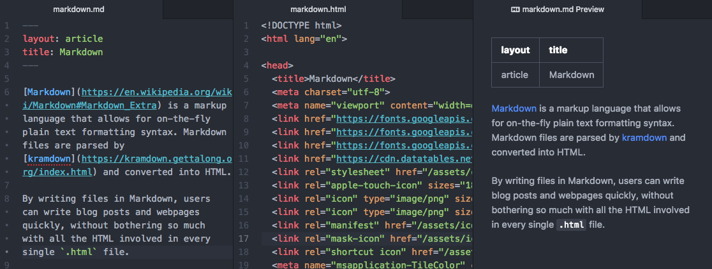

[Markdown](https://en.wikipedia.org/wiki/Markdown#Markdown_Extra) is a markup language that allows for on-the-fly plain text formatting syntax. Markdown files are parsed by [kramdown](https://kramdown.gettalong.org/index.html) and converted into HTML.

By writing files in Markdown, users can write blog posts and webpages quickly, without bothering so much with all the HTML involved in every single `.html` file.

<figure class="figure my-4">
  
  <figcaption class="figure-caption">How the same file looks in Markdown, HTML, and Markdown Preview.</figcaption>
</figure>

All of this is useful, since exporting notes, publishing articles, and organizing websites becomes much easier.

<hr>

#### Syntax

<div class="row mt-2">
  <div class="col-sm-6 mt-2" markdown="1">

```md

# Header 1

## Header 2

### Header 3
#### Header 4
##### Header 5
```


  </div>
  <div class="col-sm-6 mt-2">
    <h1 class="my-0">Header 1</h1>
    <h2 class="my-0">Header 2</h2>
    <h3 class="my-0">Header 3</h3>
    <h4 class="my-0">Header 4</h4>
    <h5 class="my-0">Header 5</h5>
  </div>
</div>
<div class="row mt-4">
  <div class="col-sm-6" markdown="1">

```md

*Italics*
**Bold**
~~Strikethrough~~
`code`
```

  </div>
  <div class="col-sm-6">
    <em>Italics</em><br>
    <strong>Bold</strong><br>
    <del>Strikethrough</del><br>
    <code>code</code>
  </div>
</div>
<div class="row mt-4">
  <div class="col-sm-6" markdown="1">

```md

1. List item 1
2. List item 2
  * Something
    1. Something else
```

  </div>
  <div class="col-sm-6">
  <ol>
      <li>List item 1</li>
      <li>List item 2
        <ul>
          <li>Something</li>
        </ul>
        <ol>
          <li>Something else</li>
        </ol>
      </li>
    </ol>
  </div>
</div>
<div class="row mt-4">
  <div class="col-sm-6" markdown="1">

```md

[Text](#)

[Google](www.google.com)
```

  </div>
  <div class="col-sm-6">
    <a href="#">Text</a><br>
    <a href="http://google.com">Google</a>
  </div>
</div>
